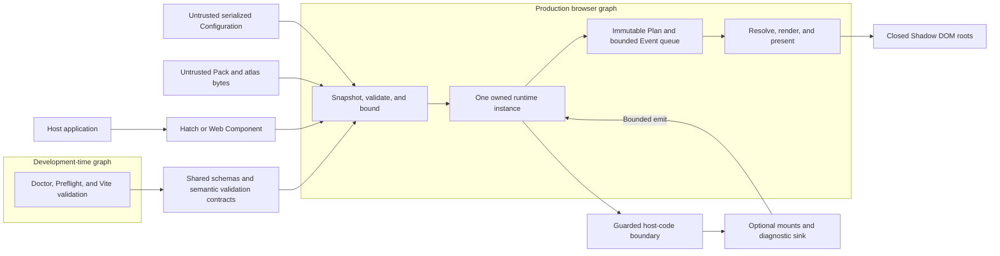

# Peekling engine design

Status: implemented contract for version `0.1.3`. Tests and release gates verify
the behavior described here on their recorded environments. Release evidence is
valid only when it is bound to exact source and artifacts. See
[Releasing Peekling packages](docs/RELEASING.md) for that procedure.

Peekling has one browser engine and several thin entry surfaces. The design
keeps delivery, pack data, host intent, and trusted host code at explicit trust
boundaries.

## Architecture at a glance

Both public entry surfaces create the same runtime instance. Serialized
Configuration, Pack data, and atlas bytes cross the untrusted-data gate before
the runtime compiles its Plan or creates rendering resources. The instance then
owns its Event queue, scheduler, resolver, renderer, and content surfaces.
Optional mounts and diagnostic sinks are trusted host code behind guarded
property-only seams. Their later results return through normal Event admission.
Doctor, Preflight, and Vite reuse the validation contracts during development,
but they remain outside the production browser graph.

## Public surfaces

- `Peekling.hatch(...)` and `hatch(...)` create the same owned runtime instance.
- `<peekling-character>` is a lifecycle façade over that API. It defines no
  Plan, renderer, validator, or visibility system of its own.
- The complete browser file claims each surface only when its browser name is
  free. It preserves unrelated host globals and custom elements, reports a
  collision without throwing, and can still provide the other surface. npm
  consumers may import named ESM modules from the same package and rely on
  static tree shaking.
- Importing the ESM root has no registration side effects. Hosts call
  `definePeeklingElement()` when they want the declarative facade. The complete
  browser file registers it automatically.
- Site visibility helpers are deliberate public recovery controls. Pack parsing
  and validation for authoring tools lives at `@peekling/runtime/pack` rather
  than the ordinary runtime root.
- `NativeManifest` is the data-only pack authoring and distribution contract.
- `NormalizedPack` is the stable data-only adapter output contract. It is not
  the runtime's private canonical state and is not an authoring format.

## Runtime pipeline

The loader parses data, validates the selected public Pack form, verifies live
resource constraints, and produces an instance-owned normalized snapshot. The
Event admission layer records bounded browser and application facts. One
immutable Plan evaluates typed Rules. Channel-scoped Effects with disjoint
ownership compose. Explicit conflict policies resolve intended competition.
Ambiguous writes to the same named surface or data channel fail compilation.
State resolution maps validated Capabilities into Pack States. One renderer
applies the composed motion, character State, and named surface output.

Lifecycle safety surrounds the pipeline. Pause, page suspension, reduced motion,
site dismissal, and destroy own clock rebasing, cleanup, and resource release.
Temporary Overrides enter the same channel ownership model without mutating the
Plan. Content adapters and diagnostic sinks run only at isolated host-code
boundaries.

The normative ordering and lifetime rules are in
[the v0.1 execution model](docs/execution-model.md).

## Trust boundaries

Character packs and serialized options are untrusted data. Every object is
closed and every resource is bounded. Packs cannot contain functions, DOM nodes,
HTML, callbacks, telemetry instructions, or arbitrary URLs.

Configuration resource URLs and content links pass two gates. JSON Schema checks
their shape and lexical safety. The shared semantic URL validator then requires
a same-origin relative reference or an absolute HTTPS URL with a valid authority
and no credentials. Pack-internal atlas `src` values follow a narrower rule:
they must be safe relative paths inside the Pack. Theme colors are limited to
lowercase `transparent` or exact 3, 4, 6, or 8 digit hex forms. They cannot
contain CSS resource or image syntax.

The Web Component snapshots its `options` property before merging it with
element properties and scalar attributes. Only own data properties cross that
boundary. Record objects must use this JavaScript realm's ordinary
`Object.prototype` or a null prototype. Custom prototypes, inherited
Configuration, and ordinary objects from another realm are rejected. Arrays
remain structured data. Accessors are rejected without being evaluated.
JavaScript cannot identify a Proxy without reflection. A Proxy trap may
therefore run during inspection, but a thrown trap becomes a controlled
readiness failure instead of escaping into the host page.

An element whose `options` property was never assigned starts from its scalar
attributes. Configuration must select an explicit `character`, `packUrl`, or
inline `pack`. Without one, readiness rejects with `manifest.selection` before
network work begins. Explicitly assigning `null` is also invalid, just as
`hatch(null)` is invalid. The current `ready` promise rejects, no root remains,
and a later valid assignment starts a fresh mount.

Mount functions, logger callbacks, and framework bridges are trusted host code.
They are property-only and never become Pack or JSON content. Any Control is
host UI inside a mounted surface, not a runtime callback field. Peekling catches
synchronous throws and rejected promises at these boundaries, owns cancellation
and cleanup, and keeps the character lifecycle safe. Static validation cannot
prove their business behavior safe.

Peekling performs no telemetry and owns no network service. Its only network
work is fetching the manifest and assets selected by the host. Diagnostics are
in-process records delivered only to an optional host sink.

## Package boundaries

The public repository is an npm workspace with five publishable packages:
`@peekling/runtime`, `@peekling/preflight`, `@peekling/vite`, `@peekling/cli`,
and `@peekling/adapter-codex-pet`. The runtime has no production dependencies.
Preflight is a pure development-time validation API and a thin consumer of the
Node-safe `@peekling/runtime/preflight` subpath. It declares the exact runtime
version as both a peer and development dependency, which prevents a second stale
validator copy from being installed beside the application runtime. The Vite
plugin applies that validation to declared JSON files without adding client
modules. The CLI owns Doctor and bounded Pack authoring utilities. The adapter
translates one external data format into the validated normalized adapter IR.
None of the four developer or adapter packages enters the browser bundle.

The production CDN artifact contains the complete browser runtime and no
developer tooling or framework adapter. Host Configuration is supplied later at
hatch or Web Component initialization. `peekling doctor` validates bounded JSON
Configuration and optional Pack input without importing project code or
contacting the network. `@peekling/preflight` is the shared programmatic seam,
and `@peekling/vite` integrates it with Vite startup, watched JSON changes, and
production builds. Runtime admission and tooling collection use one
dependency-free semantic kernel. The browser supplies a compact fail-fast sink,
while Node tooling supplies collecting diagnostics and suggested fixes from a
tooling-only entry. The Vite JSON reader reaches the canonical bounded Pack data
parser through `@peekling/preflight/json`. Source-aware analysis, bundle
inspection, and other build integrations are future developer-tool work. They
must remain outside production browser graphs.

The runtime still includes the minimum bounded validator, normalizer, compiler,
and security gates needed for dynamic Configuration and untrusted remote Pack
data. Build-time inspection cannot validate bytes or values that exist only at
page load. ESM can omit unused optional entry points and adapters through static
tree shaking where side effects permit. The complete CDN runtime has a separate
full-runtime budget.

Website code, design-system primitives, character art, hosted services, and
authoring skills are outside this repository.
