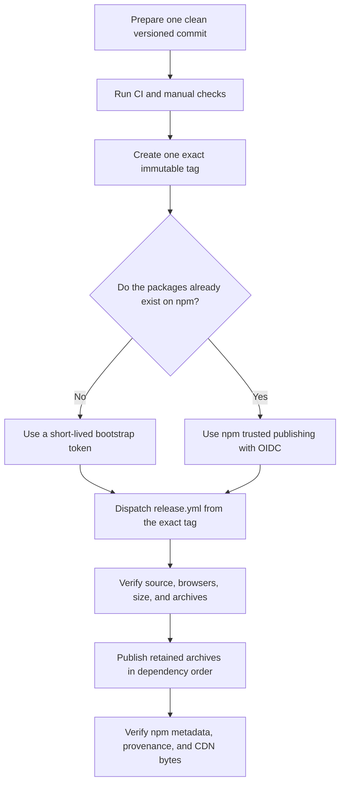

# Releasing Peekling packages

Peekling publishes through the protected manual workflow in
`.github/workflows/release.yml`. The workflow verifies an exact tag, creates one
set of package archives, and publishes those same bytes in dependency order.

## Prerequisites

Before preparing a release, confirm all of the following:

- Use Node 22.14.0 and npm 11.16.0 for release certification.
- Install Chromium, Firefox, and WebKit for the local browser gates.
- Start from a clean tracked commit with all five packages on one version.
- Configure the public GitHub origin. Package `repository`, `homepage`, and
  `bugs` values must be derived from that origin.
- Confirm that CI passes for the exact commit that will receive the tag.
- Use an immutable tag in the form `v<workspace-version>`, such as `v0.1.0`.
- Keep the source repository public so npm can attach public provenance.
- Confirm access to the `@peekling` npm scope and the protected `npm-production`
  GitHub environment.

## Command guide

| Command                                  | Use it for                                                                                                                        |
| ---------------------------------------- | --------------------------------------------------------------------------------------------------------------------------------- |
| `npm run check:core`                     | Formatting, builds, linting, boundaries, workflow policy, metadata, distribution, types, tests, local size, and smoke performance |
| `npm run release:verify:packages`        | Clean-source reconstruction, reproducible builds, package scans, archives, and isolated consumer checks                           |
| `npm run release:verify:local`           | Full local release verification without requiring a tag or clean immutable source                                                 |
| `npm run release:verify -- --tag v0.1.0` | Full release verification plus clean-source, origin, and exact-tag checks                                                         |
| `npm run release:workflows`              | Static checks for the CI and publication workflow safety controls                                                                 |
| `npm run size:release`                   | Canonical size evidence using the exact release toolchain                                                                         |

Install dependencies and run the complete local verification before tagging:

```sh
npm ci --ignore-scripts
npx --no-install playwright install chromium firefox webkit
npm run release:verify:local
```

On Linux or in a fresh CI image, install browser system dependencies too:

```sh
npx --no-install playwright install --with-deps chromium firefox webkit
```

## Release flow



In prose, the process is:

1. Prepare one clean commit with matching workspace and package versions.
2. Run CI, local release verification, and the manual checks below.
3. Create one immutable tag that matches the workspace version.
4. Use a short-lived npm token only when creating packages for the first time.
   Use trusted publishing with OIDC for routine releases.
5. Dispatch `release.yml` from the tag and enter the same tag as its input.
6. Let the workflow verify and retain the archives before it publishes them.
7. Check npm and both supported CDNs against the retained package contents.

## What automated verification covers

Release verification uses Node 22.14.0 and npm 11.16.0. Public tooling supports
Node 22.14 or newer, but only the exact release toolchain can certify compressed
browser-size evidence.

`npm run size` checks current local artifacts against the local limit and
release reserve on any supported Node version. It does not compare local work
with an earlier release record or published size prose. `npm run size:release`
first rejects a noncanonical toolchain, then verifies the immutable record,
artifact hashes, compressed measurements, and controlled documentation.

The manual publication workflow runs `npm run test:peek:published` before
release certification. This gate fetches the exact version-pinned default
character manifest, verifies its embedded SHA-256, and rejects the release when
the default `character: "peek"` path is unavailable or has drifted. The default
character Pack has its own pinned version. An engine patch release does not
require an otherwise unchanged character Pack to publish the same version.

The local verifier runs:

- Core checks and canonical size certification.
- The Chromium, Firefox, and WebKit browser matrix.
- The [browser performance gate](browser-performance.md).
- A dependency audit at the high severity threshold.
- Clean-source reconstruction and two byte-for-byte build comparisons.
- Package file audits and isolated consumer installation checks.

The source and package scanners inspect every packed text file, including source
maps and declaration maps. A `private/` path, credential file, private key, or
supported token pattern fails the run. Scanner paths use portable separators
before containment and private-path checks, so nested traversal and Windows
absolute forms fail before a file is read. Temporary archives and isolated
consumer directories are removed before the verifier returns.

The browser gate writes raw evidence to `artifacts/browser-performance.json`.
Release evidence must identify contract `peekling-browser-performance-v0.1`,
profile `release-0.1.0`, and `releaseAcceptance: true`. Chromium, Firefox, and
WebKit must each provide exactly 40 cold and 40 warm samples. The threshold
object must contain only the immutable 30 and 50 ms first-frame limits and the 2
and 10 ms runtime-callback limits. Missing, extra, changed, nonnumeric, or
nonfinite values fail the gate. The quick performance command creates a
different report identity and cannot satisfy CI or release acceptance.

The runtime archive has an exact file inventory. It contains the supported ESM
root, Pack and Preflight tooling subpaths, browser assets, declarations, and
declaration maps. The Preflight package imports the supported runtime subpath
and declares an exact runtime peer. It does not bundle another validator copy.
The standalone browser source entry remains outside the archive.

All five publishable packages share one workspace version and release in
lockstep. A runtime hotfix therefore requires a coordinated five-package
release. This v0.1 constraint does not permit publishing unchanged or unverified
package archives.

## Manual checks

These checks depend on real devices or publication infrastructure and are not
enforced by CI. Completing them does not change runtime quality.

Before tagging:

- Render the CDN installation examples and inspect pinned URLs, stylesheet
  loading, SRI values, and `crossorigin` behavior.
- Review the browser performance report and controlled size evidence for the
  exact candidate.
- Test representative host pages on real devices.
- Check keyboard use, reduced motion, accessible names, announcements, focus,
  and dismissal behavior with relevant assistive technology.
- Confirm the public origin, passing CI commit, exact package versions, npm
  scope access, protected environment, and selected authentication mode.
- Review the public API contract, changelog, licenses, notices, package file
  lists, and browser budgets.

## One-time repository and npm setup

1. Add the public GitHub origin. Then add the exact derived `repository`,
   `homepage`, and `bugs` values to the root and all five package manifests. The
   verifier prints the required values and rejects guessed or mismatched URLs.
2. Enable private vulnerability reporting. Confirm that
   [`SECURITY.md`](../SECURITY.md) opens the repository's private reporting form
   and provides a safe fallback.
3. While signed in to npm, confirm control of the `@peekling` scope and all five
   package names. An `E404` response alone does not reserve a name or prove
   publish permission.
4. Create a protected GitHub environment named `npm-production`. Restrict which
   branches can use it and configure its required reviewers.
5. Keep the repository public while publishing with provenance. npm cannot
   create public provenance for a package built from a private repository.
6. Require full commit SHA pins in the repository Actions policy. Every
   third-party action in the release workflow is pinned to a full SHA.

The workflow runs on GitHub-hosted runners and grants `id-token: write` only to
the publish job. Repository contents remain read-only.

## Bootstrap publication

npm trusted publishing cannot be configured for a package that does not exist.
For the first publication only:

1. Create a short-lived granular npm token named `NPM_TOKEN`.
2. Limit it to the `@peekling` scope and only the permissions needed to create
   these public packages.
3. Enable the npm 2FA bypass required for CI publication.
4. Store the token only in the protected `npm-production` environment.
5. Run the protected manual workflow from the exact tag.
6. Revoke the token as soon as all five package pages exist.

The workflow exposes `NPM_TOKEN` only to its five archive publication steps. The
workflow audit rejects additional release secrets and long-lived publish
credentials elsewhere.

## Routine publication with OIDC

After the first version exists, configure npm trusted publishing separately for
each package with these values:

- GitHub organization or user that owns the public repository.
- Exact repository name.
- Workflow filename `release.yml`.
- GitHub environment `npm-production`.
- Permission to run `npm publish`.

Remove `NPM_TOKEN` from the environment after trusted publishing works. Routine
releases then use the short-lived OIDC identity requested by the GitHub-hosted
runner. Keep `id-token: write`, the protected environment, and public provenance
enabled.

## Review and tag

Build from a clean checkout with Node 22.14.0 and npm 11.16.0. Run the local
verification and complete the manual checks. Then run the immutable-source
verification with the intended tag:

```sh
npm run release:verify -- --tag v0.1.0
```

A passing result requires a clean tracked commit, an exact tag on that commit, a
configured GitHub origin, and package repository metadata derived from that
origin.

The tag must be `v` plus the workspace version and must resolve to the exact
release commit. Do not move or reuse a release tag. CI for that commit must pass
before publication.

CI retains the raw browser performance report for 30 days. The manual release
workflow retains its performance report, archive manifest, and package archives
for 90 days before any publish step begins. The report is machine evidence, not
immutable-source proof, so the clean commit and exact tag remain required.

## Run the manual workflow

Open the `Publish Peekling packages` workflow. Choose the exact release tag as
the workflow ref, then enter the same tag in the `tag` input.

The workflow guard compares the event ref, event commit, workflow-file commit,
checked-out commit, and package version before installing dependencies or
building packages. Any mismatch stops the job.

The workflow then:

1. Installs the exact Node and npm versions without dependency lifecycle
   scripts.
2. Installs all three Playwright engines and their Linux dependencies.
3. Verifies the published default character, canonical size, full release
   source, browsers, performance, dependencies, and packages.
4. Builds each package before packing, then packs it once with package lifecycle
   scripts disabled.
5. Records every archive filename, byte count, and SHA-256 in
   `artifacts/release-packages/manifest.json`.
6. Scans and installs those exact archives in an isolated consumer.
7. Uploads the archive manifest, package archives, and performance report.
8. Verifies the retained bytes again and publishes them without rebuilding.

The workflow publishes in dependency order:

1. `@peekling/runtime`
2. `@peekling/adapter-codex-pet`
3. `@peekling/preflight`
4. `@peekling/vite`
5. `@peekling/cli`

Each publication command disables lifecycle scripts and passes
`--provenance --access public` to npm. Release concurrency is serialized, so two
manual runs cannot publish at the same time.

The workflow audit enforces step structure as well as command text. The tag
guard must run before installation and verification. Archive verification must
run before every publish step, and package publication must follow dependency
order. Critical jobs and steps cannot be conditional or use `continue-on-error`.

## Post-release verification

After all five packages publish:

1. Confirm each npm page shows the intended version, files, dependency graph,
   and provenance.
2. Fetch the exact jsDelivr and unpkg runtime, stylesheet, and SRI files.
3. Compare the fetched CDN bytes with the retained package contents.
4. Record the workflow run, commit, tag, package integrity values, and CDN
   comparisons in the release record.

## Recovery

A partial publication is unsafe because the five packages release in lockstep.
If a publish step fails or a released version is unsafe:

1. Stop later package publications when possible.
2. Identify every package version that reached npm.
3. Deprecate affected versions with a clear message.
4. Fix the issue and publish a coordinated patch version through the same
   release process.
5. Verify npm and CDN bytes again after the patch release.

Never replace package or CDN bytes at an existing version. npm unpublish rules
and CDN caches make deletion an unreliable recovery plan.
