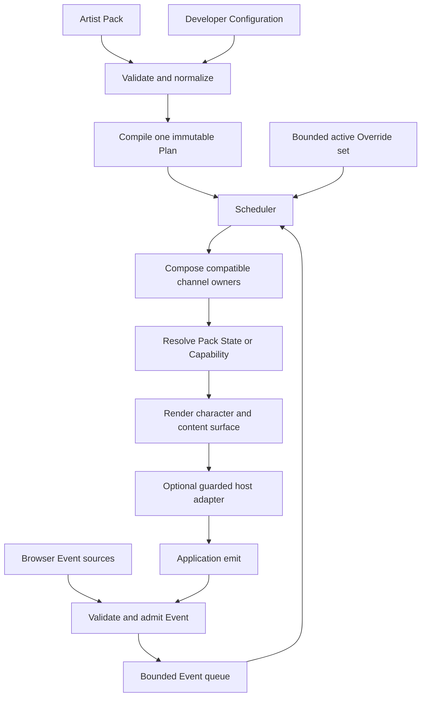
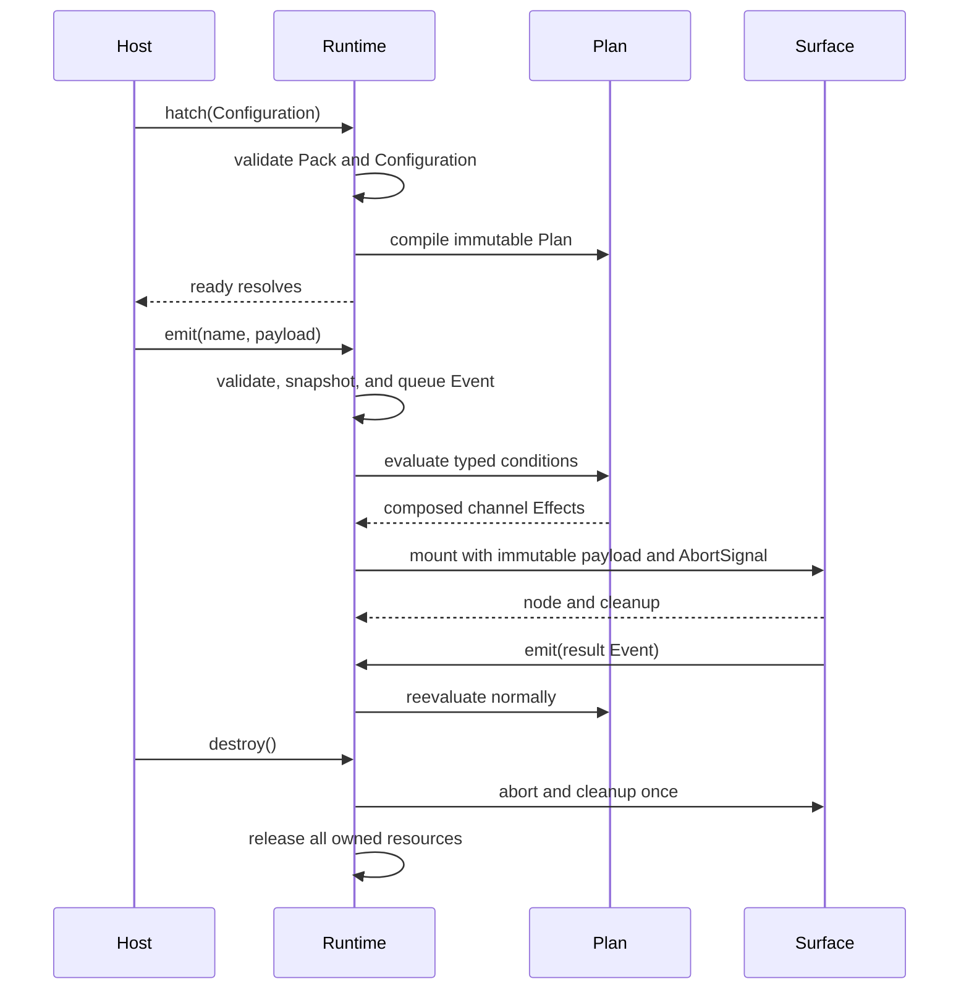
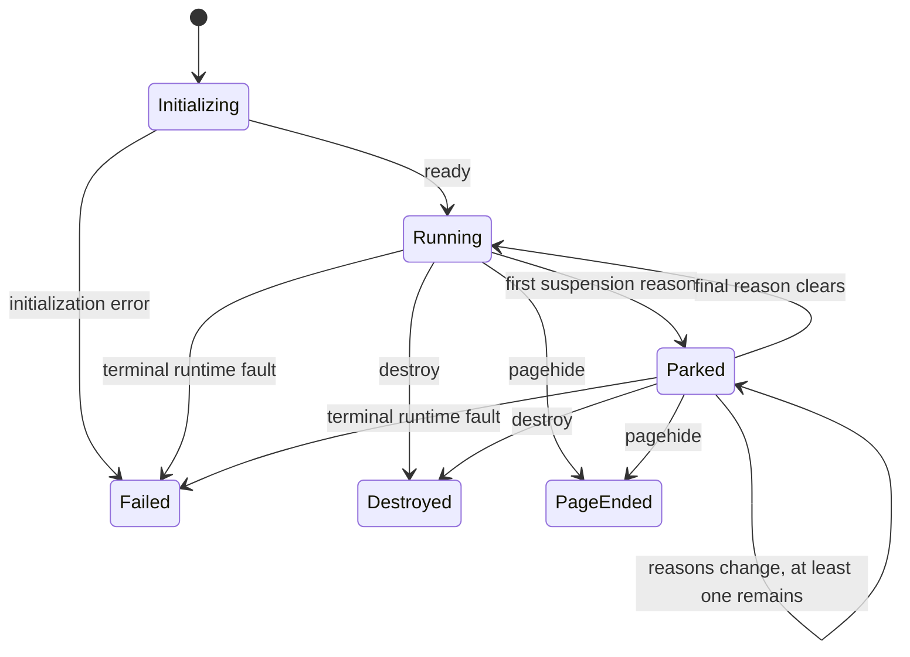

# Peekling 0.1.3 execution model

> [!IMPORTANT] This is the implemented runtime contract for version `0.1.3`. The
> [configuration guide](configuration.md) is the task-oriented entry point.
> Source, package, and publication checks live in the
> [release guide](RELEASING.md).

This document defines how a valid Pack and developer Configuration become
observable runtime behavior. See [Configure Peekling](configuration.md) for the
quick start, vocabulary, and examples.

## Core invariant

One instance owns:

- one validated Pack snapshot.
- one immutable compiled baseline Plan.
- one normalized Event admission queue.
- one bounded active Override set.
- one scheduler and channel-aware Effect composer.
- one character renderer and one DOM content-surface manager.
- one composable lifecycle and cleanup owner.

There is no second simple behavior engine, hidden Plan, content scheduler, or
framework-specific lifecycle inside core.

## Runtime flow



The scheduler never calls host code while selecting an Effect. A content adapter
may run only after selection at a guarded seam. Its later result returns through
`emit`, never through a scheduler wait.

## Hatch sequence

Build-time doctor checks complement this sequence but never replace it. Dynamic
Configuration, Web Component properties, and remote Pack bytes may be known only
in the browser, so the production runtime must retain the minimum bounded gates
needed to validate, normalize, compile, and reject them safely.

Hatch follows this order:

1. Validate the serializable Configuration shape and bounds.
2. Begin abortable Pack and selected asset loading.
3. Validate Pack data, resource headers, bytes, geometry, and references before
   creating rendering resources where the browser permits.
4. Compile the configured or engine-default Plan into an immutable
   instance-owned representation.
5. Validate every exact State, Capability, content ID, selector, and adapter
   reference against the selected Pack and host Configuration.
6. Create isolated DOM, observers, queues, scheduling, and lifecycle ownership.
7. Render the first valid Effect and resolve `ready`.

Step 1 runs synchronously before hatch returns a handle. A configuration failure
there throws and creates no `ready` or `finished` promise. After a handle
exists, any later failure rejects `ready` once after partial resources are
released. The non-rejecting `finished` promise then settles with reason
`failed`. Hatch must not leave active listeners, observers, timers, frames, DOM,
object URLs, or unsettled handles after failure.

## Page lifetime

An instance exists for one document lifetime unless its host destroys it sooner.
Refresh and document navigation end it through `pagehide`. A `pushState`, hash,
or client-side route change does not automatically destroy a direct hatch
instance. A single-page application must call `destroy()` when the owning view
ends. Disconnecting the Web Component performs the same teardown for its owned
instance.

`pagehide` is page end, including when the browser places the document in its
back-forward cache. The runtime drains already accepted facts through Plan
evaluation, observes the declared terminal `page.lifecycle` fact, and tears down
without mounting new host UI. A later `pageshow` does not revive that runtime.
Direct hatch callers create a fresh instance. A still-connected Web Component
creates a fresh mount automatically after a persisted `pageshow`.

Programmatic teardown settles `finished` with reason `destroyed`. Page end uses
reason `pagehide`. The promise settles exactly once after cleanup even when
teardown signals repeat.

`0.1.3` does not serialize, persist, restore, or transfer Plan state, Event
queues, Overrides, character position, content state, or runtime handles across
pages. Application-owned data may be passed into the new page's Configuration or
emitted as new Events, but that is a fresh instance with fresh validation.

The site-level dismissal preference is visitor preference data, not instance
restoration. It may begin a fresh instance in a suspended state under its own
separate documented policy.

## Event sources and admission

The initial browser Event sources are:

- pointer click.
- pointer movement.
- document visibility.
- window focus.
- scroll.
- configured section visibility.
- page lifecycle.

Observers capture the minimum bounded facts required for normalization. They do
not cancel, stop, synthesize, or replace native page interaction. High-frequency
observations update bounded state or coalesce under a documented policy. Event
frequency never directly sets rendering cadence.

An observed window scroll invalidates the current continuous pointer target
before its scroll fact enters the queue. Follow-pointer motion therefore stops
at the current character position. A later pointer observation establishes the
next target and makes continuous pointer motion eligible again. Scroll remains a
passively observed page interaction throughout this transition.

Applications call `emit(name, payload)`. Admission validates the Event name and
JSON-like payload, assigns an ID, and returns an accepted, coalesced, or
rejected result. It does not mutate the Plan, select an Effect inline, render
inline, or call host code inline.

The 0.1 queue admits at most 32 Events. Application facts and discrete browser
Events keep FIFO order. Once full, the queue rejects the new fact with
`reason: "queue-full"`. It never evicts an accepted fact. Pausing stops
evaluation, not bounded admission. Destroyed, dismissed, invalid, and not-ready
instances return their matching rejection reason.

Every accepted Event schedules an evaluator turn. If bounded work leaves more
accepted Events in the queue, the runtime schedules the next turn itself. It
does not wait for a later pointer observation, animation frame, or host call to
make progress. Reduced-motion mode uses the same queue-draining rule.

`when.coalesce: "latest"` is the only coalescing policy. Application Rules may
use it only for one unambiguous ordered surface stream. The compiler requires a
shared session field and revision field. Only a strictly newer tail Event for
the same session replaces the prior tail. `window.scroll` is the only browser
Event that may opt in. A stale fact can still be accepted when admission cannot
know the result of earlier queued facts. Plan evaluation then reports it as
stale for the affected ordered surface. Valid effects on other channels still
run.

Event payload is first-class immutable data. A matching Rule can expose its
payload to the selected content surface. For example, a `job.finished` Event
with `{ changedFiles: 4 }` can render "Four files changed." The runtime passes a
validated immutable snapshot, not the caller's mutable object reference.

Payload access is scoped to the Event activation that selected the Effect. Later
host mutation of the original input cannot change rendering. The runtime does
not retain payloads beyond their documented activation and surface lifetime.

Queue fairness means accepted Events retain documented order and cannot wait
behind an unbounded Event. Runtime coalescing is available only through the
documented `coalesce: "latest"` policy. A host that needs another rate limit
must apply it before calling `emit`. Overflow remains observable and bounded.

### Plan state and runtime state

The immutable Plan is the rulebook. Runtime state is the scoreboard. The
character can follow the pointer while job progress stays visible because those
outputs own different channels. The Plan declares those ownership boundaries.
Runtime state records what is happening now, such as position, character State,
the latest accepted progress revision, and the current Override owners.

An Event can change runtime state only through a matching Rule. It never adds,
removes, rewrites, or restructures a Rule or any other part of the Plan.

### Presentation channel ownership

Every Effect declares its presentation channels. At minimum, the model has
motion, character State, and named surface data channels. Compatible Effects
compose when their ownership is disjoint. A pointer Rule may own motion while a
`job.progress` Rule owns only `surface:job-progress`. A later pointer Event
therefore cannot reset job progress.

If two Rules can write the same named surface or data channel, their Plan must
declare an explicit conflict policy. Hatch rejects an ambiguous overlap during
validation or compilation and identifies both Rules and the channel in a bounded
diagnostic. Runtime arrival order never becomes an implicit last-Event-wins
policy. Displacement must be explicit.

### Event disposition

A Rule that may match while an Effect or surface is active declares exactly one
disposition on that surface:

- **update in place** keeps the active ownership and applies newer validated
  data.
- **replace** settles the active ownership under its documented result and
  selects the new Effect.
- **ignore** leaves the active output unchanged and reports the documented
  admission result.
- **temporary interrupt** owns its declared channels until a bounded duration
  ends or a named completion Event arrives, then releases and reevaluates the
  unchanged Plan.

The compiler accepts `update`, `replace`, `ignore`, and `interrupt`. The
scheduler does not infer a disposition from Event names or content IDs. Replace
or interrupt must be explicit when one output intentionally displaces another.
An interrupt Effect must provide `until`. The closed forms are
`{ type: "duration", ms }` and `{ type: "event", name, timeout? }`. A missing
event timeout uses the one-hour safety ceiling. A newer interrupt replaces an
older one only when their declared channels overlap. Its completion Event first
releases the interrupt, then remains available to ordinary matching Rules. The
completion name may be an application Event or a discrete browser Event.
`pointer.click`, document visibility, window focus, scroll, and page lifecycle
can be completion Events even when no baseline Rule observes them. Continuous
`pointer.move` and `section.visibility` observations cannot complete an
interrupt and fail compilation if named there.

`until` also works when an Event Rule owns only `state` or `motion`. A surface
is not required. This is the canonical revert pattern for a temporary state: the
Event Rule selects the state with a bounded duration or completion Event, then
the runtime releases that channel back to the previously selected Rule. An Event
Rule without `until` remains latched until another matching Rule owns the same
channel or the instance ends.

A duration `ms` value is required, finite, and between 1 millisecond and the
one-hour safety ceiling. Missing or non-finite deadlines fail compilation. The
scheduler also refuses a non-finite wake time if malformed compiled data reaches
that internal boundary.

### Ordered mutable progress

An Event stream that represents mutable progress carries a bounded correlation
or session ID and an ordered revision. Revision order is scoped to the session.
The runtime admits the documented first revision and monotonic successors. A
late revision carrying progress 0 cannot revert a surface that already accepted
progress 42.

Every ordered Rule that writes the same named surface uses one session field.
Its non-terminal Rules also use one revision field. The compiler rejects mixed
field contracts before hatch, so two unrelated streams cannot close or advance
one another by reusing the same scalar value. String and number session IDs are
distinct. When one Event intentionally selects several explicit writers for the
same surface, its ordering admission is evaluated once for that Event and all
matching Rules retain declaration order. Baseline surfaces cannot declare
ordering because no Event payload exists to admit there.

Ordering admission is isolated per named surface. If one Event targets several
ordered surfaces, a stale, closed, or invalid surface does not discard valid
effects for another surface. Unordered surfaces, State, and motion also remain
eligible. Each rejected surface emits an `event.stale`, `event.closed`, or
`event.invalid` diagnostic whose metadata names the affected channel. The Event
evaluation is matched when at least one valid effect remains.

Several matching Rules may intentionally write the same ordered surface. Those
writers share one atomic ordering decision and keep declaration priority. The
runtime commits the revision only when every ordered writer for that surface
passes. A rejection leaves that surface's ordering history unchanged, while an
independent valid surface may still advance.

A terminal Event closes the session. Late progress for that session is ignored
or rejected under a documented result unless an explicit new session begins. The
usual `job.finished` Rule uses **replace** to complete the progress Effect and
select the finished Effect. It does not use a temporary interrupt that would
resume stale progress after release.

Each ordered surface keeps a bounded window of 64 recently touched sessions. The
runtime does not grow a permanent ledger for every correlation ID seen over the
page lifetime.

## Conditions and Rule evaluation

Conditions are closed typed data. They may inspect only documented Event, world,
page, and section fields through versioned bounded operators. Free-form
predicates, functions, expression strings, `eval`, and Pack code are invalid.

On reevaluation:

1. lifecycle determines whether ordinary work may proceed.
2. active Overrides claim only their declared channels.
3. eligible Rules are considered in developer declaration order per channel.
4. declared conflict policies select owners for competing channels.
5. disjoint channel Effects compose.
6. references resolve against the validated Pack and Configuration.
7. the renderer applies the composed character and content output.

Declaration order is user-authored priority within declared channel competition.
A lower Rule is not promised a competing channel while a higher Rule remains
eligible. Fairness applies to Event admission. Disjoint Overrides admit
immediately. Conflicting ownership rejects or explicitly replaces only its
conflicts instead of waiting behind another Override.

For Event-matched state and motion, a later admitted Event replaces the previous
owner of that channel. If several Rules match the same Event, declaration order
still chooses the owner. Named surface overlap remains stricter and needs the
explicit disposition described above.

Continuous `pointer.move` and section `while-visible` conditions may select
state or motion. They cannot mount a surface or start an interrupt because those
operations require a discrete Event activation. The compiler rejects that
combination instead of accepting a Rule that can never present its content.

Section `enter` and `leave` observations are discrete queued facts with
`selector`, `previousRatio`, and `ratio`. Rules match the selector, phase, and
threshold crossing. An ordinary edge Effect latches its State, motion, or
surface ownership until a later Event replaces that channel. An edge Effect with
`until` is temporary and releases to the prior owner or baseline.

## Effects

An Effect is declarative data. It can select:

- explicit ownership of motion, character State, and named surface data
  channels.
- one exact Pack State or Pack Capability.
- bounded movement and target data.
- one content ID and safe presentation data.
- a bounded hold or release condition.

It cannot contain a callback, DOM node, HTML string, network instruction,
telemetry instruction, or free-form predicate. A State name has no implicit
motion meaning. Motion uses an explicit Pack Capability mapping.

The closed motion union has seven modes. `follow-pointer` resolves a bounded
vector toward the latest pointer target and stops at its arrival radius.
`horizontal-patrol` alternates between left and right floor targets.
`viewport-traverse` advances through safe floor, wall, ceiling, and wall phases.
`move-to` targets one bounded viewport coordinate. `move-to-target` resolves an
anchor from host-approved target geometry. `jump-to` interpolates a bounded
coordinate and lift arc. `svg-path` samples detached browser SVG geometry over a
bounded duration. No motion string is evaluated as code.

Patrol and traversal targets use the current viewport, rendered character width
and height, and declared edge inset. Target-aware motion reads a cached geometry
snapshot that is invalidated by resize, relevant DOM mutation, and scroll. Path,
jump, and direct coordinate samples clamp to character-safe viewport bounds.
Each velocity-based movement request includes its remaining target distance, so
a frame cannot overshoot the selected target.

If follow-pointer motion has no target or produces no request inside its arrival
radius, the composed output clears a selected `locomotion` Capability and uses
the exact baseline State when one is declared. This normalization is independent
of whether motion and State share one Effect owner. It does not replace an
independently selected exact State or mutate channel ownership.

Each Plan Effect and each Override owns its own patrol direction, traversal
phase, jump clock, and path clock. A new patrol owner starts toward the right. A
new traversal owner begins from the nearest safe corner. A temporary interrupt
therefore cannot change the underlying owner's phase. Releasing an owner
discards its internal motion state, and instance reset clears every Plan motion
state. Viewport changes recalculate the current target before the next movement
step. If character size and offsets leave no travel, targets collapse without
producing an out-of-bounds request.

Compatible Effects form one composed output. Content does not race through a
separate scheduler, and a named surface conflict without declared policy is a
compile-time Configuration error.

Character frame presentation is renderer-neutral above an internal seam. The
default DOM atlas renderer and optional Canvas 2D renderer receive the same
resolved State, clock, position, density, and lift. They do not own Pack
loading, Plan evaluation, motion, interaction, target geometry, or lifecycle.
Content surfaces stay in DOM for native controls and accessibility under both
renderer choices.

## Direct character interaction

Direct interaction is an instance input layer, not a Pack capability and not a
second Plan. The runtime owns one accessible character button above either
visual renderer. Pointer capture, click separation, keyboard activation, badge
presentation, and cleanup belong to that instance.

A pointer down begins direct ownership. Drag updates the character center from
the original grab offset. Plan motion stays evaluated but cannot change position
while drag or throw owns it. Pointer release either settles, enters time-based
throw integration, or catches a declared target. Landing and catching release
direct ownership to the unchanged Plan.

Release velocity is expressed in CSS pixels per second. Gravity integrates over
the bounded frame step. Side and top collisions retain the configured bounce
fraction. Floor collision always settles. A catch reads only the approved target
rectangle and can enqueue one configured application Event through normal Event
admission.

Character press is independent from drag. A drag beyond the movement threshold
suppresses its trailing click. A press can show, hide, or toggle owned content,
emit one bounded application Event, or do nothing. Notification indicators
change the accessible name and owned badge only. They do not enter the Event
queue or mutate the Plan.

Host controls can call `setContentVisible(visible)` or `toggleContent()` on the
instance. These presentation operations use the same owned content renderer and
do not affect channel ownership, Event admission, or Plan evaluation.

Reduced-motion mode retains direct dragging and keyboard press. It suppresses
autonomous Plan motion and release momentum, then settles the character at the
safe floor position.

## Overrides

**Override** is direct temporary control through `instance.override(...)`.

An admitted Override temporarily selects an Effect before the baseline Plan. It
has a finite ceiling or explicit cancellation route and returns a handle with a
stable ID, status, completion, and idempotent cancellation.

The Override claims only its declared channels. A motion-only Override does not
displace a progress surface unless the author explicitly gives it that surface
channel with replace or interrupt policy.

Admission does not flush unrelated Events or Overrides. An overlap rejects by
default. Explicit `mode: "replace"` releases only conflicting Overrides.
Cancellation, expiry, a matching completion Event, dismissal, or destroy settles
the handle once. Release reevaluates the unchanged baseline Plan from current
world state.

The runtime admits at most eight active disjoint Overrides. It rejects overflow
and conflicting ownership instead of creating hidden unbounded waits. The
scheduler does not wait for a host promise, DOM event listener, framework
render, or business operation before it can release an Override.

## Content surfaces and Controls

A selected Effect may provide `contentId`, safe presentation data, and the
matching Event payload. The developer Configuration maps the ID to a generic
surface definition.

Structured text and link data are rendered with DOM APIs. Raw HTML strings,
HTML-parsing sinks, inline event attributes, and callbacks in Pack data are
forbidden.

Visible surfaces in the same region stack by stable surface ID using code-unit
order. Event arrival timing does not change that order. Surfaces in different
regions keep their independent placement.

Trusted custom rendering uses a mount function. Core supplies an empty,
engine-owned root inside the selected surface. The mount appends nodes created
for that mount and returns cleanup. Core does not adopt, reparent, or take
ownership of an arbitrary existing host element.

Conceptually:

```ts
type SurfaceMount = (
  context: Readonly<{
    surfaceId: string;
    contentId: string;
    region: ContentRegion;
    root: HTMLElement;
    data: JsonValue | undefined;
    signal: AbortSignal;
    emit: (name: string, payload?: unknown) => EmitResult;
  }>,
) =>
  | {
      update?: (data: JsonValue | undefined) => void | PromiseLike<void>;
      cleanup: () => void | PromiseLike<void>;
    }
  | PromiseLike<{
      update?: (data: JsonValue | undefined) => void | PromiseLike<void>;
      cleanup: () => void | PromiseLike<void>;
    }>;
```

The returned controller exposes `cleanup` and optional `update` as own data
properties. The runtime snapshots their descriptors without evaluating
accessors. An accessor, malformed controller, or throwing Proxy reflection trap
fails only that surface. JavaScript cannot inspect a Proxy without invoking some
reflection traps, so Peekling contains thrown traps but cannot make reflection
side-effect free.

The runtime guards synchronous throws and rejected thenables from mount, update,
and cleanup. It keeps at most one update in flight and retains one latest data
snapshot while that update is pending. It aborts the adapter when its surface
loses ownership or the instance is destroyed, calls admitted cleanup once, and
ignores late completion. Ownership changes also replace the engine-owned mount
root. Stale host work can mutate only the detached old root. An adapter fault
reports a bounded diagnostic, removes only the failing surface, and cannot end
the scheduler or break the host page.

A Control is one optional host-owned interactive item inside a surface. It is
not a core built-in or scheduler concept. The host mount owns its listeners and
reports later outcomes through `emit`. Peekling guards the mount, update,
cleanup, and promise boundaries, and the scheduler never awaits host work.

Framework-specific adapters are separate packages over this mount-and-cleanup
seam. React, Vue, Svelte, or another framework never becomes a core dependency
or a second runtime.

## Changing content data

There is no public direct content-update operation. Typed Event-driven updates
flow through `emit`. For example:

- `job.progress` carries `{ completed: 12, total: 20 }`.
- `job.finished` carries `{ changedFiles: 4 }`.
- `sync.failed` carries a bounded error code suitable for presentation.

The matching Rule selects the surface, and that surface receives the immutable
Event payload. This keeps content changes in the same ordering, validation,
lifecycle, and diagnostic model as other application facts.

The Rule also declares update in place, replace, ignore, or temporary interrupt.
Progress flows use a session ID and ordered revisions even when intermediate
Events coalesce. High-frequency progress should use an eligible
`coalesce: "latest"` Rule or a host-side rate limit before `emit`. The runtime
has no `rateLimit` Plan field. A second direct update interface would add
another ownership and ordering model. It should be added only if real use cases
cannot be expressed cleanly as typed Events.

## Lifecycle sequence



## Suspension and reduced motion

Host pause, document visibility, page lifecycle, and site dismissal are
composable suspension reasons. Resume occurs only after every active reason
clears.



The active suspension-reason set decides whether the instance is running or
parked. Reduced motion is separate. It changes rendering policy while the
instance remains in its current lifecycle state. `Destroyed`, `PageEnded`, and
`Failed` are terminal outcomes that settle `finished` after cleanup.

Suspension freezes Plan schedules, Override lifetimes, animation, movement, and
owned content timing. Deadlines are rebased once. Resume does not run catch-up
intervals or stale motion bursts. The runtime also cancels pending frame and
plan timers, detaches its input collectors, and disconnects section observers.
They attach once after every suspension reason clears.

Reduced motion is a safety policy, not a competing Plan. It renders a validated
static tableau, suppresses spatial motion, settles incompatible Overrides under
the documented reason, and preserves host-page interaction. The default
`motionPreference: "system"` follows the browser preference. A host may choose
`"full"` for an experience whose direct manipulation and physics must remain
active, or `"reduce"` for a deliberately static instance.

## Strict CSP and host policy

Strict Content Security Policy compatibility is a `0.1.3` release gate. Peekling
must not require `unsafe-inline` or `unsafe-eval`. It does not inject raw HTML
or inline event attributes.

A page must still permit the runtime and its required styles and Pack resources.
Peekling cannot operate on a page that forbids all scripts or all applicable
styles. Supported strict-CSP deployments include:

- a self-hosted ESM bootstrap allowed by the page's `script-src`.
- a self-hosted complete browser file allowed by `script-src`.
- exact version-pinned external script and `peekling.css` assets whose origins
  are explicitly allowed, with release-provided SRI where the delivery mode
  supports it.
- a Web Component written directly in external markup and upgraded by the
  allowed browser file.

Each closed shadow root loads the external stylesheet. Runtime positions and
theme tokens change through that stylesheet's CSSOM, not element style
attributes. The browser file resolves the sibling stylesheet automatically. An
explicit `styles: { url, integrity }` configuration, or the matching
`styles-url` and `styles-integrity` element attributes, selects another pinned
asset. ESM hosts should configure the asset because bundlers copy package CSS in
different ways. Cross-origin CSS must allow CORS access. Browser tests enforce
`style-src-attr 'none'` without a blanket inline-style allowance.

External Pack files remain subject to `connect-src`, `img-src`, CORS,
mixed-content, and browser policy.

CSP, pinned URLs, allowlisted origins, and SRI form defense in depth. They do
not eliminate every supply-chain risk and do not prove a relationship between
published bytes and reviewed source. Release CI must build from an immutable
source revision, verify all distributed artifacts, generate and retain hashes
and SRI values, and record artifact provenance.

## Isolation and recovery

Runtime DOM is encapsulated in closed Shadow DOM where supported. It is not a
security boundary. Runtime-owned state is instance-local except for explicitly
documented per-document visitor controls.

Host callbacks, surface adapters, diagnostic sinks, and their rejected promises
are guarded. Runtime faults are contained, diagnosed, and either recovered or
cleaned up without throwing into unrelated host work. Runtime code never moves
focus or suppresses native pointer, touch, scroll, or keyboard behavior.

The browser main thread is shared. Host long tasks may delay Peekling frames,
and Peekling work may delay the host. The release contract requires bounded
tasks, controlled cadence, and measurable behavior under contention. Ordinary
parking has zero runtime work. A clock-based dismissal is the one explicit
exception and owns one bounded recovery timeout. It does not promise independent
scheduling that the browser cannot provide.

Site dismissal clears active Overrides and parks the runtime. The host restores
the existing instance with `Peekling.visibility.show()` in the browser build or
`showPeekling()` in ESM. A normal host settings control should call that helper
for discoverable recovery. The hidden corner gesture is an optional escape
hatch, not the only supported route.

## Destroy and failure invariants

Destroy is terminal and idempotent. It:

- aborts Pack fetches, upgrades, and active surface adapters.
- settles Event and Override handles under documented results.
- cancels animation frames, timers, and scheduled work.
- disconnects observers and removes listeners.
- calls surface cleanup exactly once.
- removes owned DOM.
- revokes object URLs and releases resources.
- makes later operations return their documented inert or rejected result.

A host-surface fault follows the per-surface path above. An unrecoverable core
frame, geometry, or owned-root integrity fault follows the terminal path. The
runtime emits one `internal.frame-failed` diagnostic, stops future frame work,
and destroys that instance. Cleanup is idempotent. Another Peekling instance
does not share the failed instance's state or resources. The document's
visibility control is intentionally shared. If that root is adopted into another
document, all instances registered to it take the same terminal cleanup path.

## Implementation notes

- The current Doctor and `@peekling/preflight` inspect bounded Configuration,
  Plan, and optional Pack data. Add future source-aware analysis and bundle
  inspection only in the dev-tool graph. The browser performance harness and CI
  evidence stay in repository tooling. None of these tools belong in browser or
  CDN graphs.
- Keep only the validators, normalizers, compiler checks, and resource-security
  gates required for dynamic input in `@peekling/runtime`. Test browser bundles
  to prove no CLI, Node, build-tool, or framework adapter module is reachable.
- Give the complete CDN artifact a standalone full-runtime budget. Tree shaking
  of optional ESM imports is separate evidence and cannot justify the CDN size.
- Compile public Plan syntax to one private canonical representation. Do not
  reintroduce a second evaluator beside the canonical Plan evaluator.
- Keep browser adapters, Event normalization, Plan evaluation, scheduling,
  resolution, rendering, and surface mounting at internal seams. Do not export
  implementation classes merely to test them.
- Test through the same hatch and Web Component interfaces used by callers.
- Make clocks and admission dependencies injectable for deterministic trace,
  cancellation, overflow, and suspension tests.
- Never hold the scheduler on a host promise. Guard promise settlement and
  ignore late results with generation or ownership tokens.
- Treat every queue limit, lifetime, payload cap, and coalescing rule as a
  versioned observable contract.
- Fault-inject every lifecycle stage. Assert zero unhandled page errors and zero
  leaked nodes, observers, listeners, timers, frames, URLs, adapters, or
  handles.
- Gate Chromium, Firefox, and WebKit under strict CSP, hostile host callbacks,
  repeated mount and teardown, navigation, reduced motion, backgrounding, and
  shared-main-thread contention.

## Release evidence boundary

Passing tests support a bounded reliability claim for the measured source,
browsers, machines, and scenarios. They do not prove that Peekling is bug-free
or that arbitrary host code cannot affect a shared browser thread.

The [browser performance gate](browser-performance.md) runs the actual built
browser delivery under strict CSP in Chromium, Firefox, and WebKit. It retains
raw samples and provenance with the CI or release run. Cross-version, device,
and research comparisons are outside this release gate.

Contract consistency requires implementation, package exports, schema,
declarations, examples, tests, CI, clean builds, and retained evidence to agree
with this document.
