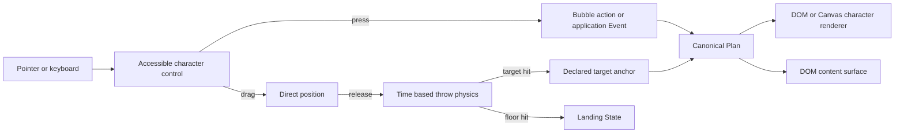

# Character interaction and motion

Peekling 0.1.1 uses one configuration model. Common behavior starts with a named
preset. Product-specific behavior uses the same JSON-safe Plan objects that
power every other runtime feature. There is no expression language, script
string, or second scheduler to learn.

```js
import { hatch } from "@peekling/runtime";

const peek = hatch({
  character: "peek",
  preset: "companion",
});

await peek.ready;
```

The `companion` preset follows the pointer when the selected Pack provides the
`locomotion` capability. The character is also an accessible button that can be
dragged and thrown. These interactions are enabled by default.

## What owns each behavior

```text
host Configuration
  |
  +-- preset or Plan ----------> normal motion and character State
  +-- targets -----------------> approved host geometry
  +-- interaction -------------> press, drag, throw, catch, and landing
  +-- indicator ---------------> notification on the character control
  +-- content and bindings ----> controls inside the character bubble
```



The Plan remains the normal behavior owner. Direct manipulation temporarily owns
position while a drag or throw is active. After landing or catching, ownership
returns to the unchanged Plan.

## Default character control

Unless `interaction: false` is set, each instance creates one engine-owned
button over the visual character. The visual atlas remains pointer-transparent.
The button provides:

- pointer capture for mouse, pen, and touch dragging
- a four CSS pixel threshold that separates a click from a drag
- keyboard activation for the configured press action
- an accessible label supplied by `interaction.label`
- an optional dot or count indicator
- the same hit geometry for the DOM and Canvas character renderers

The defaults are:

| Setting         | Default          | Result                                       |
| --------------- | ---------------- | -------------------------------------------- |
| `press`         | `toggle-content` | Show or hide owned content surfaces.         |
| `drag`          | `true`           | Move the character with direct manipulation. |
| `throw`         | `true`           | Continue with release velocity and gravity.  |
| `gravity`       | `1800`           | CSS pixels per second squared.               |
| `maxThrowSpeed` | `1800`           | CSS pixels per second.                       |
| `bounce`        | `0.35`           | Retained velocity at top and side bounds.    |
| `floorInset`    | `8`              | Safe gap above the viewport floor.           |

When there is no content surface, the default press action has no visible
effect. Set `press: "emit"` and `pressEvent` to make a character click report a
host Event. Set `press: "none"` when drag is the only desired interaction.

```js
const pathRunner = hatch({
  character: "peek",
  interaction: {
    press: "emit",
    pressEvent: "path.run",
    label: "Run the custom route or drag Peek",
  },
  plan: customSvgPathPlan,
});
```

## Throw lifecycle

Velocity is sampled from pointer movement in CSS pixels per second. The runtime
smooths the latest samples, caps the release vector with `maxThrowSpeed`, then
integrates gravity using elapsed time. Long frames are bounded before they enter
the physics step.

The viewport sides and top can bounce. The viewport floor always settles the
character. While direct manipulation owns position, Plan motion is suppressed.
The runtime selects these character States when they exist:

| Phase           | Default State | Override field |
| --------------- | ------------- | -------------- |
| Held or dragged | `scroll:fly`  | `dragState`    |
| Rising          | `scroll:fly`  | `riseState`    |
| Falling         | `scroll:fall` | `fallState`    |
| Landing         | `success`     | `landState`    |

Pack resolution applies the normal safe fallback when a default State is not
available. A configured State name must still use the Pack State grammar.

Reduced-motion mode preserves direct dragging. Release momentum and autonomous
motion are suppressed, and the character settles on the safe floor position.

## Host targets and catching

`targets` maps a bounded lowercase ID to a host-approved CSS selector. Plans and
interaction settings refer only to the ID. This keeps selectors at the host
boundary and lets the compiler reject unknown target references.

```js
const nookCompanion = hatch({
  character: "peek",
  targets: {
    "sunlit-nook": "#peek-sunlit-nook",
  },
  interaction: {
    catchTarget: "sunlit-nook",
    catchAnchor: "top",
    catchMargin: 28,
    catchEvent: "nook.settled",
  },
  plan: {
    baseline: {
      channels: ["motion", "state"],
      motion: {
        type: "move-to-target",
        target: "sunlit-nook",
        anchor: "top",
        speed: 220,
        arrivalRadius: 8,
      },
      state: { capability: "locomotion" },
    },
    rules: [],
  },
});
```

Target tracking reads `getBoundingClientRect()` from the selected element. It
does not move, style, reparent, click, or write into host DOM. Resize, relevant
DOM changes, viewport resize, and scrolling invalidate the cached snapshot.
`instance.refreshTargets()` lets the host request a refresh after an
application-specific layout change.

Dropping within `catchMargin` snaps the character to `catchAnchor`. A configured
`catchEvent` then enters the normal bounded application Event queue. Motion can
also use the same target through `move-to-target`.

## Motion types

Every motion object has a required `type`. Optional numeric values are finite
and bounded by schema and semantic compilation.

| Type                | Behavior                                                 |
| ------------------- | -------------------------------------------------------- |
| `follow-pointer`    | Move toward the latest pointer target.                   |
| `horizontal-patrol` | Alternate between safe left and right floor targets.     |
| `viewport-traverse` | Traverse floor, walls, and ceiling around the viewport.  |
| `move-to`           | Move toward one bounded viewport coordinate.             |
| `move-to-target`    | Move toward an anchor on a declared host target.         |
| `jump-to`           | Interpolate to a coordinate with a bounded vertical arc. |
| `svg-path`          | Sample a host-authored SVG path over a bounded duration. |

Finite motion stops at its target and releases the `locomotion` capability back
to an exact baseline State when one is available. Patrol and traversal motion
continue until another Rule, Override, drag, throw, or lifecycle state owns the
motion channel.

### Viewport traversal

```json
{
  "channels": ["motion", "state"],
  "motion": {
    "type": "viewport-traverse",
    "speed": 126,
    "edgeInset": 22,
    "clockwise": true
  },
  "state": { "capability": "locomotion" }
}
```

Traversal recomputes four character-safe corners from the current viewport and
rendered character size. The nearest corner becomes the initial phase, then the
route proceeds clockwise or counterclockwise.

### SVG path motion

```json
{
  "channels": ["motion", "state"],
  "motion": {
    "type": "svg-path",
    "path": "M0 0 C-180 -120 -180 220 0 180 C180 140 180 -80 0 -160",
    "duration": 5200,
    "relative": true
  },
  "state": { "capability": "locomotion" },
  "until": { "type": "duration", "ms": 5400 }
}
```

The runtime creates a detached SVG `path` element and uses browser geometry to
sample it. Path text is never evaluated and never enters an HTML parsing sink.
At most 16 valid paths are cached per instance. Relative motion offsets the
first path point to the character position at activation. Absolute motion uses
path coordinates directly. Every sampled point is clamped to character-safe
viewport bounds.

Use a bounded `until` lifetime for a click-triggered path that should restart on
later clicks. Set `loop: true` only when continuous motion is intentional.

## Bubble actions and indicators

Owned content can start hidden and open when the visitor clicks the character:

```js
const review = hatch({
  character: "peek",
  plan: reviewPlan,
  content: reviewContent,
  bindings: reviewBindings,
  interaction: {
    contentInitiallyHidden: true,
    clearIndicatorOnPress: true,
    label: "Open Peek's edit review",
  },
  indicator: {
    kind: "count",
    count: 1,
    label: "One edit needs review",
    color: "#b0004f",
  },
});
```

The indicator label is appended to the character button's accessible name. Count
badges accept 0 through 999 and visually cap the displayed text at 99. Use
`instance.setIndicator(next)` to replace the indicator, or pass `null` to clear
it. Set `color` to `transparent` or a supported hexadecimal color to match the
host interface. The method changes only presentation state and never edits the
Plan.

Clicking the character uses the configured press action. Applications can also
connect their own close and show controls with
`instance.setContentVisible(false)` and `instance.setContentVisible(true)`.
`instance.toggleContent()` applies the same toggle used by the default character
press. These methods affect only runtime-owned content surfaces.

## DOM and Canvas character rendering

The default root import uses the DOM atlas renderer:

```js
import { hatch } from "@peekling/runtime";
```

Canvas rendering is an explicit optional entry point:

```js
import { hatchCanvas as hatch } from "@peekling/runtime/canvas";
```

Both entry points use the same loader, Pack validation, Plan compiler, Event
queue, motion evaluator, interaction controller, target tracker, and lifecycle.
Only the character frame presentation changes. Content bubbles remain safe DOM
surfaces so controls keep native accessibility and input behavior.

Choosing Canvas does not change Configuration or Pack format. Applications can
switch renderer entry points without rewriting Plans.

## Security and performance boundaries

- Pack data remains data only and cannot add handlers or interaction code.
- SVG path strings are sampled as geometry and are never evaluated.
- Target selectors are host Configuration, capped at 16, and validated before
  the runtime begins.
- Target tracking reads geometry only while it is dirty or target-aware motion
  needs a fresh snapshot.
- Throw integration is time based and uses the existing single instance frame
  loop.
- Parked characters request no ordinary animation frame.
- The interaction root, visual root, and content root each clean up with the
  instance.

For full field bounds, use the
[authoritative JSON Schema](schema/peekling-options.schema.json) and
[TypeScript reference](schema/peekling-options-v0.1.d.ts). For Rule ownership,
Event ordering, lifecycle, and cleanup, read the
[execution model](execution-model.md).
