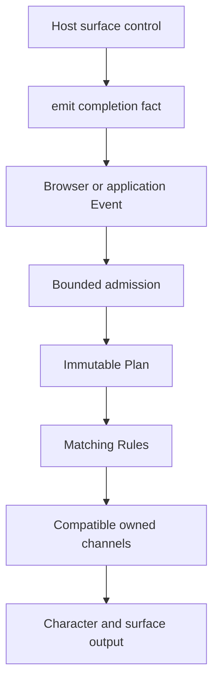

# Peekling runtime examples

These four browser examples teach the public runtime one working concept at a
time. They run against the exact local build and use a synthetic data-only Pack,
so you can inspect the engine without website code or character art.

## Run the examples

Prerequisites:

- Node.js 22.14.0 or newer
- npm 11.16.0

From the engine repository:

```sh
npm ci
npm run examples
```

Open `http://127.0.0.1:4174`. The index should list four examples. Start with
pointer follow, then work downward through Events, host surfaces, and the Web
Component lifecycle.

Set a different port when `4174` is already in use:

```sh
PEEKLING_EXAMPLES_PORT=4180 npm run examples
```

The pages load `packages/runtime/dist/peekling.js` and its sibling
`peekling.css` from this checkout. The server generates a small Pack and PNG
atlas in memory. No character art is stored in this repository.

## Learning path

| Example                                         | What to try                                                        | Public concepts                                                                 |
| ----------------------------------------------- | ------------------------------------------------------------------ | ------------------------------------------------------------------------------- |
| [Simple pointer follow](simple-pointer-follow/) | Move the pointer around the page                                   | Plan baseline, `pointer.move`, motion and State channels, locomotion Capability |
| [Job progress](job-progress/)                   | Start a job, advance it, send a stale revision, then finish it     | `emit`, ordered surface data, disjoint channels, terminal replacement           |
| [Interactive surface](interactive-surface/)     | Open the review control, save the draft, then destroy the instance | `override`, trusted mount functions, completion Events, cleanup                 |
| [Web Component](web-component/)                 | Disconnect and reconnect the element                               | `<peekling-character>`, owned lifecycle, fresh remount                          |

Expected results:

- Pointer movement changes character position without reloading the Pack.
- Progress remains visible while pointer motion continues on its own channel.
- The stale progress button cannot roll the current revision backward.
- Completing the review ends its temporary Override and cleans the host mount.
- Reconnecting the Web Component creates a new page-lifetime instance.

## Event flow used by the examples



In prose, browser observations and application facts enter the same bounded
admission path. The immutable Plan selects matching Rules. Their Effects compose
only when they own compatible channels. A trusted host control can report its
result through `emit`, which sends another application Event through the same
path.

The [configuration guide](../docs/configuration.md) defines the Plan spelling
and public API. The [execution model](../docs/execution-model.md) defines
scheduling, channel ownership, and cleanup. The examples stay focused on code
you can run.

## Security and delivery

The local server sends a restrictive Content Security Policy. It allows only
self-hosted scripts, styles, Pack data, and the Blob URL created for the
validated atlas. It forbids inline scripts, inline style attributes,
`unsafe-inline`, and `unsafe-eval`.

Every event listener is registered from an external script. Host surfaces create
text and controls with DOM APIs instead of parsing HTML strings. The runtime
loads `peekling.css` as an external stylesheet inside each closed shadow root.

Production hosts must allow their selected runtime, stylesheet, bootstrap, and
Pack origins. Read
[Browser compatibility and hosting](../docs/compatibility-and-hosting.md) for
pinned delivery, Subresource Integrity, self-hosting, CORS, and CSP guidance.

The example server is a local learning tool, not a production server. Its
`/runtime/` and `/fixture/` paths exist only while that server is running.

## Test the examples

Run the structure checks and the four flows in Chromium:

```sh
npm run test:examples
```

Run the complete Playwright suite in Chromium, Firefox, and WebKit:

```sh
npm run test:browser
```

The first command is the focused examples gate. The second command also covers
the wider runtime and host-isolation browser suite.

## Troubleshooting

- If the page does not open, check the terminal for the listening URL and try a
  different `PEEKLING_EXAMPLES_PORT`.
- If an example reports `Could not start`, rebuild with `npm run build` and
  reload the page.
- If a browser test cannot launch, install the repository's Playwright browser
  dependencies before rerunning the test command.
